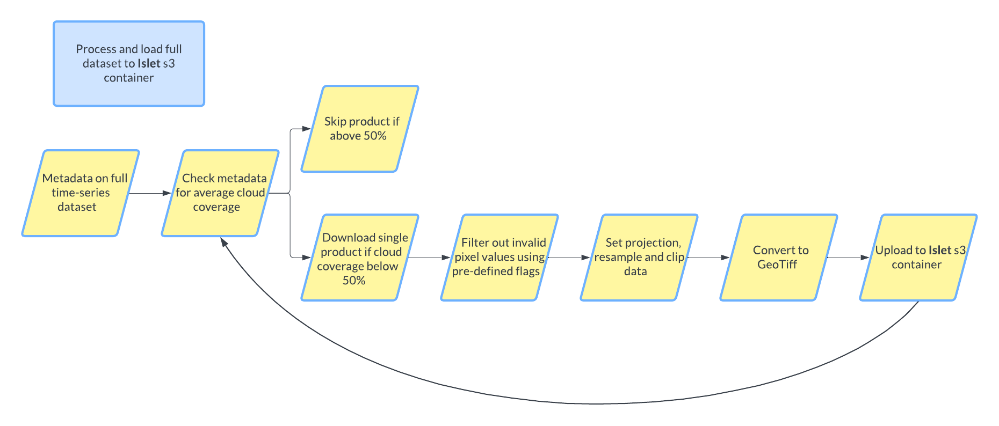

# Data processing

This folder contains script for data processing purposes. Below is a brief explanation of each file as well as an overview of the data processing flow.

 

AlgaeStorm_datasets.xlsx - Gives a brief overview of the datasets investigated.

## Python scripts

- main.py - Can be used to download, process and upload Sentinel-3 OLCI OL2WFR files to s3. Processes the data according to the process shown in the image above. 
Will set the projection to EPSG:4326 and will clip and resample to the Baltic Sea region specified. Please update if another region and projection is desired.Currently the WQSF-flags used to filter the data are set specifically for the Oa reflectance bands. Please adjust if other Sentinel-3 OLCI OL2WFR bands are used.

- split_tif_files - Will pick the first Oa0608_reflectance_masked file (as produced by main.py) for each day from s3. S3A files are prioritised over S3B files in case there is files from both sensors. It will then split the files in (1000, 1000) pixel tiles and write the tiles back to s3. In our case the shape of the raster is not evenly divisible with (1000, 1000) so some tiles will have less pixels.

- utils.py - Contains majority of the functions used in main.py and split_tif_files.py

## Jupyter notebooks

- Irradiation.ipynb - Provides an example on downloading the Fraction of Absorbed Photosynthetically Active Radiation dataset from DestinE data lake.

- SST-sentinel.ipynb - Provides an example on downloading the Sentinel-3 SLSTR Level 2 Sea Surface Temperature dataset from DestinE data lake.

- SST_Odyssea.ipynb - Provides an example on downloading the ODYSSEA Global Ocean dataset from DestinE data lake.

- Sea_wind_speed.ipynb - Provides an example on downloading the Global Ocean Daily Gridded Surface Wind dataset from DestinE data lake.

- ol2wfr-sentinel.ipynb - Provides an example on downloading the Sentinel-3 OLCI Level 2 WFR dataset from DestinE data lake. As well as providing an attempt att projecting, clipping and resampling using GDAL and gdalwarp in particular.

- project_resample_and_write_gtiff.ipynb - Gives an overview (with pictures) of the project, resample and clipping process using the PyTROLL packages satpy and pyresample.